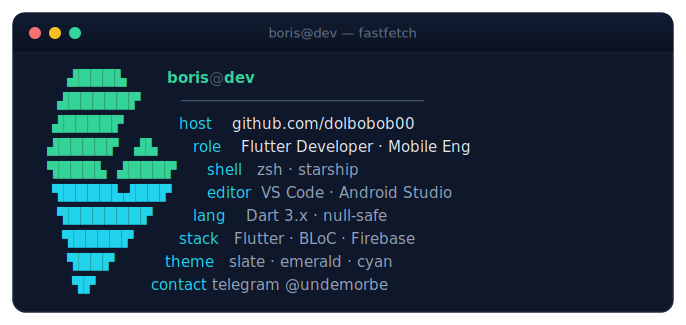
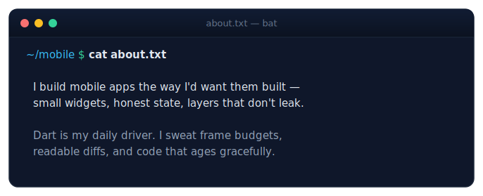
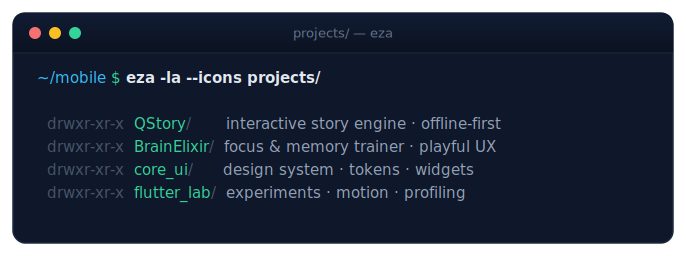
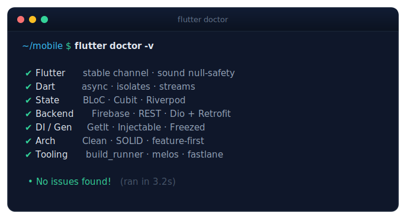
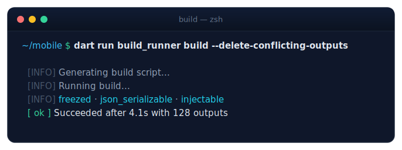
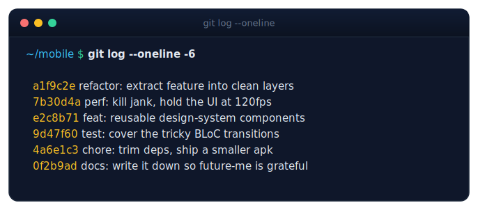
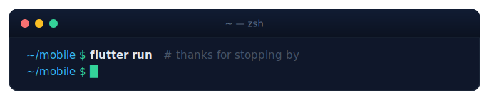

<code>&nbsp;·&nbsp;&nbsp;·&nbsp;&nbsp;·&nbsp;&nbsp;·&nbsp;&nbsp;·&nbsp;&nbsp;·&nbsp;&nbsp;·&nbsp;&nbsp;·&nbsp;&nbsp;·&nbsp;&nbsp;·&nbsp;&nbsp;·&nbsp;&nbsp;·&nbsp;&nbsp;·&nbsp;&nbsp;·&nbsp;&nbsp;·&nbsp;&nbsp;·&nbsp;&nbsp;·&nbsp;&nbsp;·&nbsp;&nbsp;·&nbsp;&nbsp;·&nbsp;&nbsp;·&nbsp;&nbsp;·&nbsp;&nbsp;·&nbsp;&nbsp;·&nbsp;</code>

## <samp>~/whoami</samp>

## <samp>~/about</samp>

<code>&nbsp;·&nbsp;&nbsp;·&nbsp;&nbsp;·&nbsp;&nbsp;·&nbsp;&nbsp;·&nbsp;&nbsp;·&nbsp;&nbsp;·&nbsp;&nbsp;·&nbsp;&nbsp;·&nbsp;&nbsp;·&nbsp;&nbsp;·&nbsp;&nbsp;·&nbsp;&nbsp;·&nbsp;&nbsp;·&nbsp;&nbsp;·&nbsp;&nbsp;·&nbsp;&nbsp;·&nbsp;&nbsp;·&nbsp;&nbsp;·&nbsp;&nbsp;·&nbsp;&nbsp;·&nbsp;&nbsp;·&nbsp;&nbsp;·&nbsp;&nbsp;·&nbsp;</code>

## <samp>~/projects</samp>

| project | stack | one-liner |
|:--|:--|:--|
| **QStory** | `flutter` · `bloc` · `hive` | Offline-first interactive story engine. |
| **BrainElixir** | `flutter` · `firebase` · `riverpod` | Focus & memory trainer with a playful UX. |
| **core_ui** | `dart` · `freezed` | Shared design system, tokens & widgets. |

<code>&nbsp;·&nbsp;&nbsp;·&nbsp;&nbsp;·&nbsp;&nbsp;·&nbsp;&nbsp;·&nbsp;&nbsp;·&nbsp;&nbsp;·&nbsp;&nbsp;·&nbsp;&nbsp;·&nbsp;&nbsp;·&nbsp;&nbsp;·&nbsp;&nbsp;·&nbsp;&nbsp;·&nbsp;&nbsp;·&nbsp;&nbsp;·&nbsp;&nbsp;·&nbsp;&nbsp;·&nbsp;&nbsp;·&nbsp;&nbsp;·&nbsp;&nbsp;·&nbsp;&nbsp;·&nbsp;&nbsp;·&nbsp;&nbsp;·&nbsp;&nbsp;·&nbsp;</code>

## <samp>~/stack</samp>

&nbsp;
&nbsp;
&nbsp;
&nbsp;
&nbsp;
&nbsp;
&nbsp;

<code>&nbsp;·&nbsp;&nbsp;·&nbsp;&nbsp;·&nbsp;&nbsp;·&nbsp;&nbsp;·&nbsp;&nbsp;·&nbsp;&nbsp;·&nbsp;&nbsp;·&nbsp;&nbsp;·&nbsp;&nbsp;·&nbsp;&nbsp;·&nbsp;&nbsp;·&nbsp;&nbsp;·&nbsp;&nbsp;·&nbsp;&nbsp;·&nbsp;&nbsp;·&nbsp;&nbsp;·&nbsp;&nbsp;·&nbsp;&nbsp;·&nbsp;&nbsp;·&nbsp;&nbsp;·&nbsp;&nbsp;·&nbsp;&nbsp;·&nbsp;&nbsp;·&nbsp;</code>

## <samp>~/build</samp>

## <samp>~/metrics</samp>

&nbsp;

 

  

<code>&nbsp;·&nbsp;&nbsp;·&nbsp;&nbsp;·&nbsp;&nbsp;·&nbsp;&nbsp;·&nbsp;&nbsp;·&nbsp;&nbsp;·&nbsp;&nbsp;·&nbsp;&nbsp;·&nbsp;&nbsp;·&nbsp;&nbsp;·&nbsp;&nbsp;·&nbsp;&nbsp;·&nbsp;&nbsp;·&nbsp;&nbsp;·&nbsp;&nbsp;·&nbsp;&nbsp;·&nbsp;&nbsp;·&nbsp;&nbsp;·&nbsp;&nbsp;·&nbsp;&nbsp;·&nbsp;&nbsp;·&nbsp;&nbsp;·&nbsp;&nbsp;·&nbsp;</code>

## <samp>~/log</samp>

Built with Dart, care, and a very dark terminal theme.

